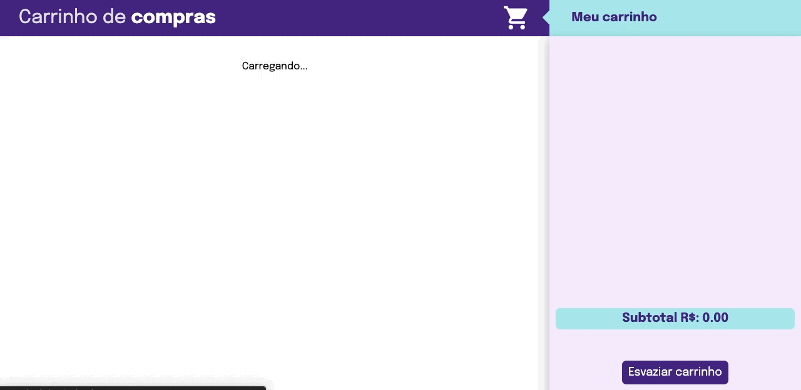

<!-- PROJECT LOGO -->
<br />
<p align="center">
  <a href="https://frontend-shopping-cart-ruby.vercel.app/">
    
  </a>
  
  <p align="center" style="color:#8FBC8B; font-size:25px">
    Carrinho de Compras 
    <br />
  </p>
</p>

<hr>

<p align="center">
  <!-- <span style="color:#66FF00; font-size:25px">Brinque</span> -->
<a href="https://frontend-shopping-cart-ruby.vercel.app/" style="color:#66FF00; font-size:25px">
    Teste o projeto! Link do deploy 🛒
  </a>
   </p>

<!-- Índice -->

<br>

<!-- Sobre o projeto -->
# Sobre o projeto
<div>

Bem-vindos ao meu repositório! 🛒

Este projeto simula um carrinho de compras dinâmico, onde é utilizada a
<a href="https://developers.mercadolivre.com.br/pt_br/itens-e-buscas">API</a> do <strong>Mercado Livre</strong> para listar produtos que estão à venda, e com eles, adicionar e remover itens do meu carrinho, atualizando em tempo real o preço total da compra!

Como os testes contribuem para a escrita de códigos mais confiáveis e com boa performance, neste projeto foi posto em prática o desenvolvimento orientado a testes (<strong>TDD</strong> - Test Driven Development), ou seja, primeiro se escreve o teste para uma função, e depois implementa-se a lógica para que a função funcione como esperado. 

Isso ajuda a garantir um código de qualidade, mostrando os casos de uso da aplicação e permitindo que ela funcione da maneira correta!

O projeto foi realizado durante o curso de desenvolvimento Web da Trybe, no módulo de front-end, com o intuito de treinar CSS, Javascript assíncrono e TDD com Jest.

A implementação das funções, do CSS e dos testes de unidade foram feitos por mim, já a configuração inicial, o esqueleto HTML e os testes de integração com Cypress foram cedidos pela Trybe, para auxiliar o aluno a atingir os requisitos propostos.

<br>

<br>

# Rodando a aplicação localmente

- Clone o repositório:
  
```bash
  git clone git@github.com:mathlaza/frontend-Shopping-Cart.git
```
- Entre no diretório do repositório:
  
```bash
  cd frontend-Shopping-Cart
```

- Instale as dependências:
  
```bash
  npm install
```

- Baixe a extensão do VSCode "Live Server";

- Clique em "Go Live" no canto inferior direito da tela, abrindo assim uma janela no navegador com o endereço local da aplicação.

<br>

- Rodando os testes unitários:
  
```bash
  npm test
```

- Verificando as porcentagens de cobertura dos testes:
  
```bash
  npm run test:coverage
```

- Rodando os testes de integração:
  
```bash
  npm run cypress
```

<br>

# Tecnologias utilizadas
Essas foram as ferramentas utilizadas durante o desenvolvimento do projeto:
* <span style="color:#58a6ff">HTML</span>
* <span style="color:#58a6ff">CSS</span>
* <span style="color:#58a6ff">Javascript</span>
* <span style="color:#58a6ff">Jest</span>
